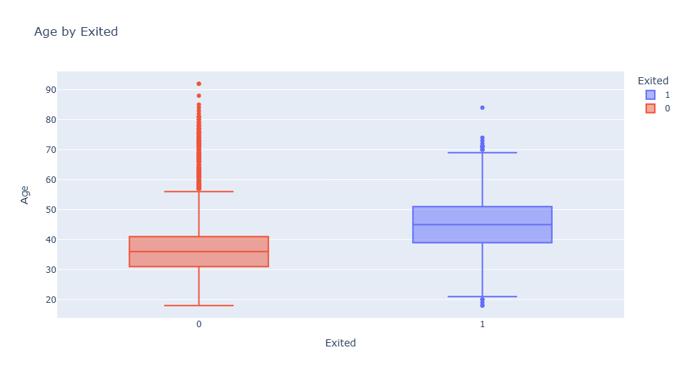
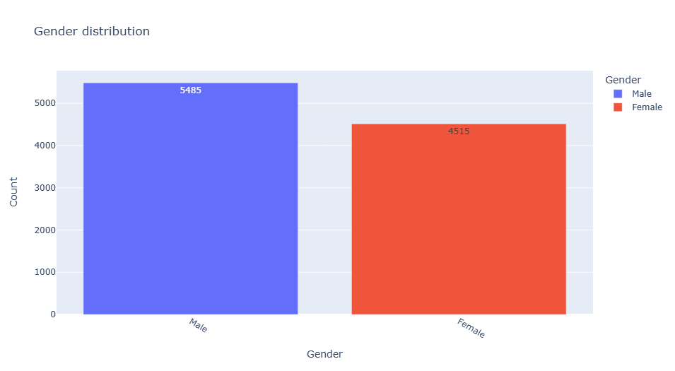
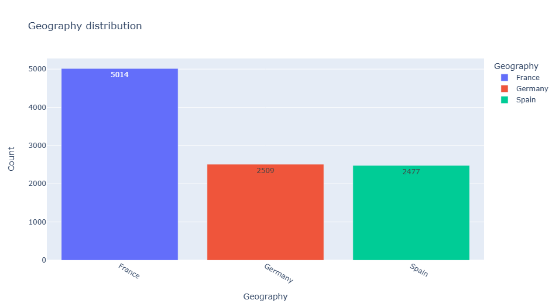
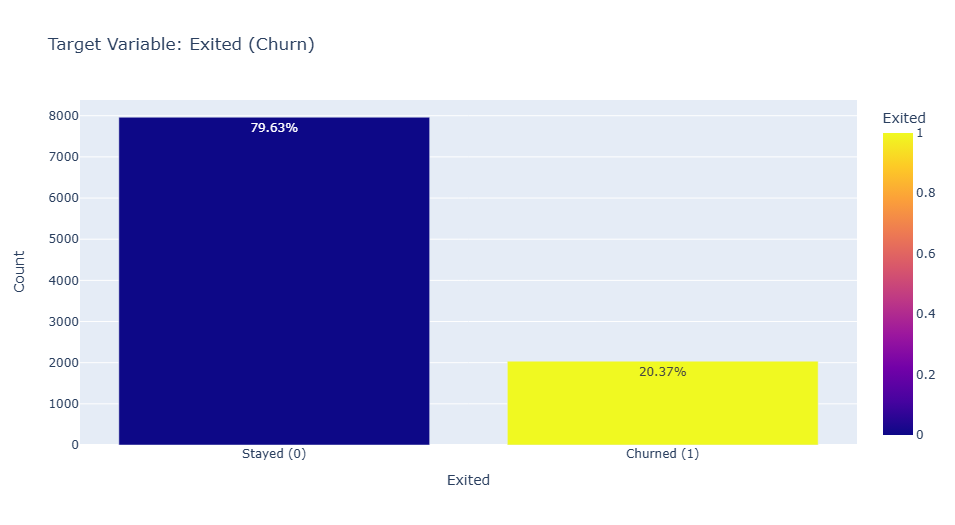
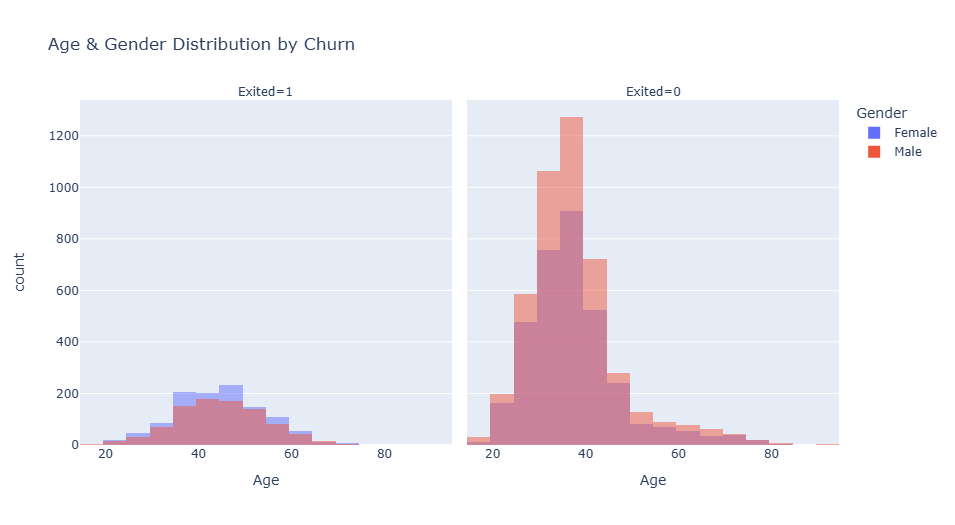
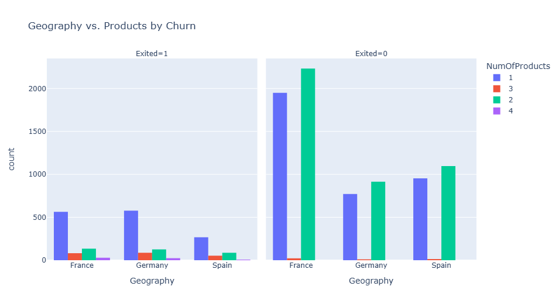

# 📊 Customer Churn Analysis

This project analyzes customer churn data from a retail bank using comprehensive Exploratory Data Analysis (EDA). The goal is to uncover key patterns and drivers of churn, providing actionable insights to improve customer retention strategies.

---

## 📁 Project Structure

```
customer-churn-analysis/
│
├── data/            # Raw dataset(s)
├── notebooks/       # Jupyter notebooks for analysis
│   └── 01-eda-churn.ipynb
├── images/          # Saved plots and visualizations
├── reports/         # Generated EDA reports
├── requirements.txt # Project dependencies
└── README.md        # Project documentation
```

---

## 📊 Dataset

- **Rows:** ~10,000 customers
- **Columns:** 14 features (Age, Gender, Geography, Balance, Products, Tenure, Credit Score, Estimated Salary, etc.)
- **Target Variable:** `Exited` (1 = churned, 0 = stayed)

> Source: [Kaggle — Bank Customer Churn Dataset](https://www.kaggle.com/datasets/barelydedicated/bank-customer-churn-modeling)

---

## 🔎 Analysis Workflow

1. **Data Cleaning & Preprocessing**

   - Imputed missing values and standardized data types
   - Encoded categorical features (e.g., Gender, Geography)

2. **Univariate Analysis**

   - Explored distributions of numerical features (Age, Balance, Salary)
   - Assessed churn rates across categorical variables (Gender, Geography, Products)

3. **Bivariate & Multivariate Analysis**

   - Investigated relationships between churn and individual features (e.g., Age vs. Churn)
   - Explored interaction effects (e.g., Geography + Products + Churn)
   - Generated correlation heatmaps for numerical features

4. **Visualization**
   - Created bar plots, histograms, boxplots, and heatmaps
   - Visualized churn breakdown by categories

---

## 💡 Key Insights

- **Overall churn rate:** ~20%
- **Mid-aged customers (39–51)** have the highest churn rate
- Customers with **only 1 product** are significantly more likely to churn
- **Geography matters:** German and French customers show the highest churn
- **Product usage** is more predictive of retention than credit score alone
- Female customers have a slightly higher churn rate than males

---

## 📷 Sample Visualizations

| Age by Exited (Box Plot)               | Gender Distribution                 | Geography Distribution                 |
| -------------------------------------- | ----------------------------------- | -------------------------------------- |
|  |  |  |

| Churn Rate                 | Age & Gender by Churn                            | Geography vs Product Churn                 |
| -------------------------- | ------------------------------------------------ | ------------------------------------------ |
|  |  |  |

_See the `images/` folder for more plots and visualizations._

---

## 🚀 Next Steps

This project is EDA-focused, but future extensions could include:

- Building machine learning models (e.g., Logistic Regression, Random Forest, XGBoost) to predict churn
- Advanced feature engineering (e.g., customer activity scores, segmentation)
- Designing and testing retention strategies for high-risk groups

---

## ⚙️ Tech Stack

- **Python:** pandas, numpy, matplotlib, seaborn, plotly
- **Jupyter Notebook** for analysis
- **GitHub** for version control and sharing

---

## 📌 How to Run

Clone the repository and install dependencies:

```bash
git clone https://github.com/yourusername/customer-churn-analysis.git
cd customer-churn-analysis
pip install -r requirements.txt

jupyter notebook notebooks/01-eda-churn.ipynb
```

Open the notebook and follow the analysis steps. All required data and images are included in the respective folders.

---

## 📬 Contact

For questions or collaboration, feel free to reach out via GitHub Issues or connect on LinkedIn.
